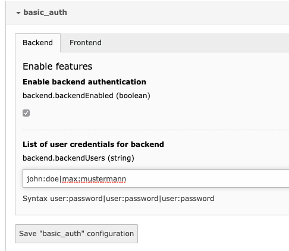

# TYPO3 Extension `basic_authentication`

This extension makes it possible to add a basic authentication for backend and frontend.

**Pro**

No need for maintaining a `.htaccess` and `.htpasswd` file as the user and their password are configured within the extension configuration.

**Con**

The extensions uses the concept of the *MiddleWares* which will only protect requests covered by those.
This means that any direct file access, e.g. to extensions or fileadmin is still possible!

## Author

Georg Ringer is part of [StudioMitte](https://www.studiomitte.com) and author and maintainer of this extension.

## Setup

### Installation

Install this extension as any regular TYPO3 extension:

- Use **composer** with `composer require studiomitte/basic-authentication`
- *or* install the extension through the Extension Manager by

### Configuration

The configuration is done in the Extension Configuration.

- Enable the authentication for the desired mode (`backend`, `frontend`)
- Define user & password in the syntax `user1:password1|user2:password`

